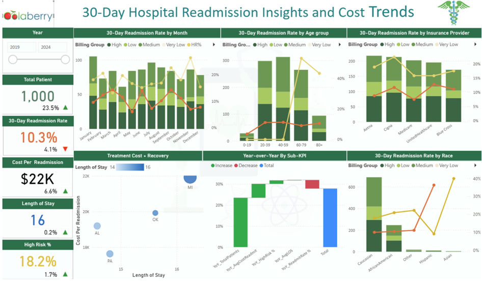

# 30-Day Hospital Readmission Insights and Cost Trends

## Project Overview

This project leverages machine learning techniques, including Logistic Regression and Random Forest, to predict patients at high risk of 30-day hospital readmission. Using Python, Microsoft Fabric, and Power BI, it transforms hospital admission data into actionable clinical insights through an executive-level dashboard. Stakeholders can explore risk factors, readmission rates, and cost trends to enable early interventions.

---

## Business Problem

Unplanned 30-day hospital readmissions significantly increase healthcare costs and strain resources. Hospitals need predictive tools to identify high-risk patients before discharge to improve patient outcomes and reduce avoidable readmissions. Current data is underutilized, limiting proactive care and cost management.

---

## Objective

- Predict patients at risk of 30-day hospital readmission using machine learning models
- Create an interactive dashboard to visualize readmission risks and cost drivers
- Enable healthcare stakeholders to identify actionable insights for early intervention

---

## Tools & Technologies

- Python
- Microsoft Fabric
- Power BI
- SQL Server
- Jupyter Notebook
- Excel
- Microsoft Azure

---

## Project Workflow

- Import and clean hospital admission data, removing duplicates and placeholders
- Engineer features including patient demographics and clinical profiles
- Train and compare Logistic Regression and Random Forest classifiers
- Build relationships and KPI tables for comprehensive analysis
- Deploy an interactive Power BI dashboard for stakeholder exploration

---

## Key Insights

- Certain patient demographics and clinical factors strongly influence readmission risk
- Random Forest outperformed Logistic Regression in predicting high-risk discharges
- Cost drivers correlate with specific risk segments, highlighting intervention priorities
- Dynamic dashboards enable real-time monitoring of readmission trends and patient volumes

---

## Final Dashboard / Project Preview

---

## Business Impact

- Improved ability to proactively identify and manage high-risk patients
- Reduced unnecessary hospital readmissions and associated costs
- Enhanced decision-making for healthcare providers and policymakers through data-driven insights

---

## Portfolio Navigation

[← Back to Portfolio Home](../README.md)
